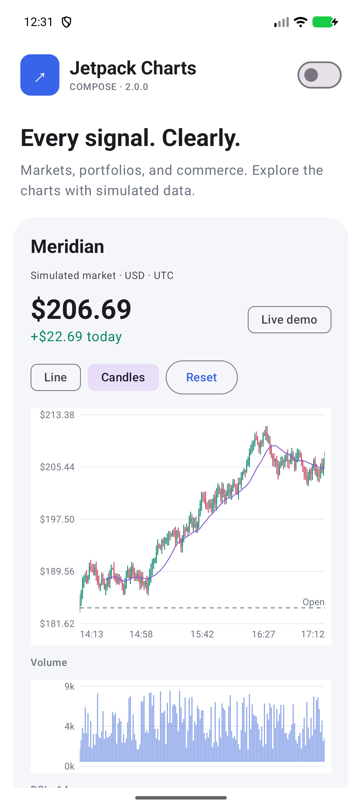
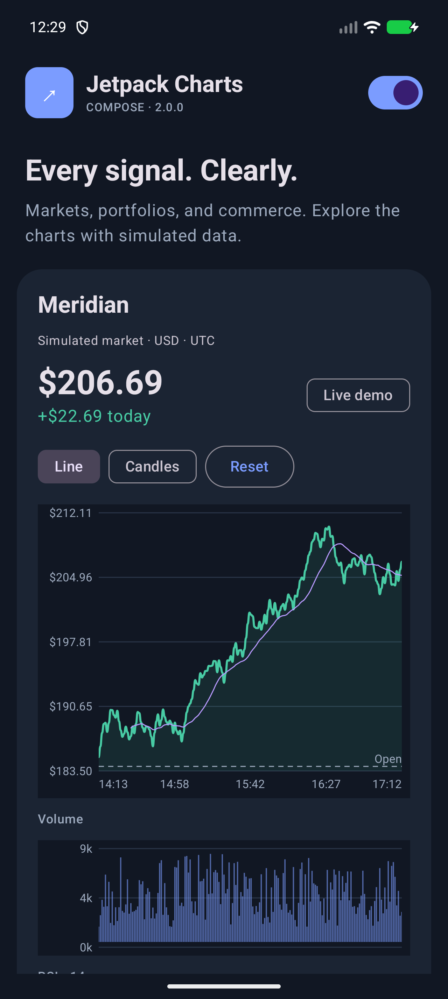

# Jetpack Charts

[](https://github.com/joelromanpr/jetpack-charts/actions/workflows/verify.yml)
[](https://central.sonatype.com/artifact/io.github.joelromanpr.charts/charts-compose/2.0.0)
[](LICENSE)

Compose charts for markets, portfolios, and commerce. Apache 2.0 · Android 6.0+ · Kotlin · Light and dark themes.

[Documentation](https://joelromanpr.github.io/jetpack-charts/) · [Chart gallery](https://joelromanpr.github.io/jetpack-charts/examples/) · [Contributing](CONTRIBUTING.md) · [Releases](https://github.com/joelromanpr/jetpack-charts/releases)

<p align="center">
  
  &nbsp;&nbsp;
  
</p>

Real screenshots from the 2.0.0 Android gallery, using simulated market data. [Run the sample](https://joelromanpr.github.io/jetpack-charts/examples/#run-the-compose-gallery) to explore linked charts, gestures, and live updates.

## Install

**[2.0.0 is available on Maven Central](https://central.sonatype.com/artifact/io.github.joelromanpr.charts/charts-compose/2.0.0).** Add the rendering artifact; core is included transitively:

```kotlin
repositories {
    google()
    mavenCentral()
}

dependencies {
    implementation("io.github.joelromanpr.charts:charts-compose:2.0.0")
}
```

The 2.0.0 artifacts use Kotlin 2.2.20 and Compose 1.9. Use the Compose compiler plugin and align a newer compatible Compose version with your app's BOM. For data and indicators alone, use `charts-core` with the same group and version.

## Draw a chart

```kotlin
import androidx.compose.foundation.layout.fillMaxWidth
import androidx.compose.foundation.layout.height
import androidx.compose.runtime.Composable
import androidx.compose.runtime.remember
import androidx.compose.ui.Modifier
import androidx.compose.ui.unit.dp
import com.joelromanpr.charts.compose.ChartTheme
import com.joelromanpr.charts.compose.LineChart
import com.joelromanpr.charts.core.Point
import com.joelromanpr.charts.core.PointSeries

@Composable
fun PriceChart() {
    val prices = remember {
        PointSeries(listOf(Point(0.0, 184.0), Point(1.0, 187.5), Point(2.0, 186.2)), "Price")
    }
    ChartTheme {
        LineChart(prices, Modifier.fillMaxWidth().height(240.dp))
    }
}
```

`ChartTheme` follows the system appearance. Supply `ChartColors` to match your brand. It works independently of Material.

## Charts and interaction

| Use | API |
| --- | --- |
| Price, area, step, smooth curves | `LineChart`, `Sparkline`, `ChartLayer.Line` |
| Grouped or stacked columns | `ColumnChart`, `ChartLayer.Columns` |
| OHLC candles | `CandlestickChart`, `ChartLayer.Candles` |
| Volume | `ColumnChart`, `ChartLayer.Columns` |
| Mixed series and independent value scales | `CartesianChart` |
| Order book liquidity | `DepthChart` |
| Allocation | `PieChart`, `DonutChart` |
| Factors and activity | `RadarChart`, `HeatmapChart` |
| Observations | `ScatterChart` |

In cartesian charts, pinch to zoom, drag horizontally to pan, and tap or hold to inspect. Keyboard and accessibility actions support point selection, zoom, and reset. Axis formatters, reference lines, legends, and draw-scope decorations are configurable.

Share a `rememberChartState()` across price, volume, and indicators to link their viewport and crosshair. `Indicators` provides SMA, EMA, RSI, Bollinger bands, MACD, and VWAP.

## Live data

Use `RollingCandleBuffer` or `RollingPointBuffer` to keep a bounded window. `append` adds a newer timestamp; `replaceLast` updates the forming candle or current quote. `snapshot()` returns an immutable series and reuses it until the data changes.

Publish snapshots from your ViewModel with lifecycle-aware state collection. Keep X values strictly increasing and finite. Empty series are valid; invalid OHLC data fails at construction. Prices use `Double`, with relative coordinate transforms for timestamp precision. Use decimal types in your app's accounting logic before converting display values.

The renderer caches paths, limits dense geometry, and selects from the original data. Pointer selection does not rebuild the chart paths. Compute indicators outside composition or remember them by snapshot.

## Develop

Open this project in Android Studio, or use JDK 17 and the checked-in Gradle wrapper:

`main` targets 2.1.0-SNAPSHOT with Kotlin 2.4.20, Compose BOM 2026.09.00, AGP 9.4.1, Gradle 9.8, and compile SDK 37. The Android API 23 minimum stays intact; published 2.0.0 artifacts are immutable.

```sh
./gradlew :charts-core:test :charts-compose:lintRelease :sample:assembleDebug apiCheck
./gradlew :charts-compose:connectedDebugAndroidTest
python3 scripts/check-device-results.py
```

Python 3 verifies executed device tests. Run `sample` for the interactive gallery and simulated live feed. See [contributing](CONTRIBUTING.md) and the compact [release checklist](docs/RELEASING.md).
